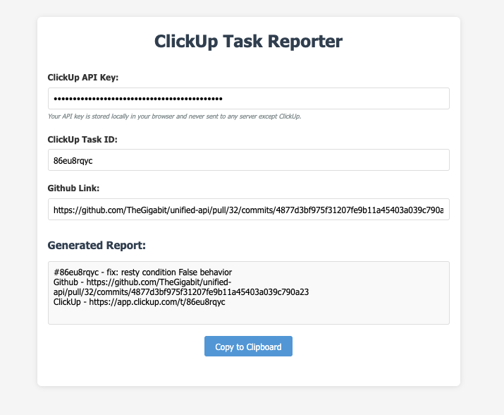

# ClickUp Task Reporter

A simple HTML/CSS/JS application that generates formatted task reports using ClickUp IDs and GitHub links. The application integrates with the ClickUp API to fetch real task names.



## Features

- Input fields for ClickUp API Key, Task ID, and GitHub link
- API integration to fetch real task names from ClickUp
- Auto-generates a formatted report when all fields are filled
- Visual feedback for empty fields and API status
- Copy to clipboard functionality
- Securely stores API key in browser's localStorage
- Responsive design

## Usage

1. Open `index.html` in a web browser
2. Enter your ClickUp API key (stored locally in your browser) (Reference: [ClickUp API Key](https://help.clickup.com/hc/en-us/articles/6303426241687-Use-the-ClickUp-API#personal-api-key))
3. Enter your ClickUp task ID
4. Enter your GitHub link
5. The report will automatically generate when all fields are filled
6. Copy the generated report using the "Copy to Clipboard" button

## Output Format

The generated report follows this format:

```
#{ClickUp ID} - {Task Name}
Github - {Github Link}
ClickUp - https://app.clickup.com/t/{ClickUp ID}
```

## ClickUp API Integration

This application uses the ClickUp API to fetch task details. Your API key is:

- Stored locally in your browser's localStorage
- Only sent directly to ClickUp's API
- Never sent to any other server

To get your ClickUp API key, follow these steps:

1. Log in to your ClickUp account
2. Go to your user settings
3. Click on "Apps" in the sidebar
4. Generate a new API key

## Project Structure

- `index.html` - Main HTML structure
- `styles.css` - CSS styling with visual feedback for errors
- `script.js` - JavaScript functionality with API integration

## Browser Support

This application works on all modern browsers that support ES6+ JavaScript and the Fetch API.
